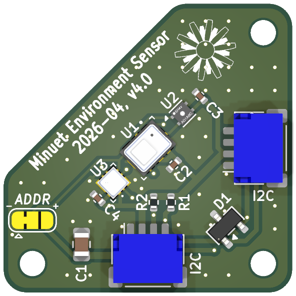
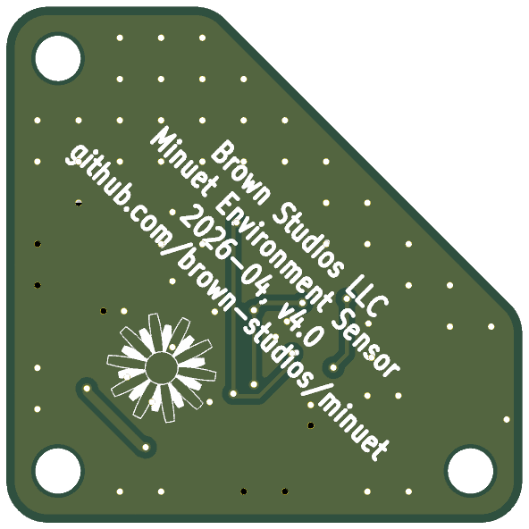

# Minuet environmental sensor accessory v4.0

**Status: UNDER DEVELOPMENT, UNTESTED**

The Minuet environmental sensor accessory measures CO₂, temperature, humidity, and barometric pressure.  It is designed to start the fan for ventilation when it gets stuffy inside.  An elevated CO₂ measurement often indicates inadequate ventilation in occupied spaces.

## Design synopsis

The [Sensirion STCC4 CO₂ sensor](https://sensirion.com/media/documents/6AED4B15/69295E41/CD_DS_STCC4_D1.pdf) measures the thermal conductivity of the surrounding air volume to estimate CO₂ concentration in standard atmospheric conditions.  It requires a discrete temperature and humidity sensor to operate and is designed to interface directly with SHT4x.  The sensor's self-calibration algorithm assumes it is exposed to fresh air of approximately 400 ppm atmospheric CO₂ concentration at least once a week.  See also: [STCC4 design guide](https://sensirion.com/media/documents/4B786C73/68E5EE93/CD_AN_STCC4_Design-In_Guide_D1_1.pdf).

The [Sensirion SHT40 temperature and humidity sensor](https://sensirion.com/media/documents/33FD6951/67EB9032/HT_DS_Datasheet_SHT4x_5.pdf) is connected directly to the STCC4.  Either the SHT40-AD1B or SHT41-AD1B sensors could be used for this application.  Both parts have similar typical accuracy, SHT40 is less expensive whereas SHT41 is more accurate at extreme temperature and humidity.  See also: [SHTxx handling instructions](https://sensirion.com/media/documents/6D95AA80/6840311F/HT_Handling_Instructions_SHTxx.pdf).

The [Bosch BMP580 pressure sensor](https://www.bosch-sensortec.com/media/boschsensortec/downloads/datasheets/bst-bmp581-ds004.pdf) provides barometric pressure compensation for CO₂ measurements to allow the STCC4 to operate over its full range of 70 to 110 kPa automatically.  It can also measure ambient temperature.  Either the BMP580 or BMP581 could be used for this application.  Both parts have ample accuracy for absolute pressure compensation, BMP580 is less expensive whereas BMP581 is more accurate for relative pressure measurements.

| Sensor             | Typical accuracy             | Recommended operating range              | Maximum operating range   |
| ------------------ | ---------------------------- | ---------------------------------------- | ------------------------- |
| STCC4 CO₂          | +/- 100 ppm + 10% of reading | 10 to 40 °C, 20 to 80 %RH, 70 to 110 kPa | -40 to 85 °C, 0 to 95 %RH |
| SHT40 Temperature  | +/- 0.2 °C                   | 5 to 60 °C                               | -40 to 125 °C             |
| SHT40 Humidity     | +/- 1.8 %RH                  | 20 to 80 %RH                             | 0 to 100 %RH              |
| BMP580 Pressure    | +/- 30 Pa abs., 6 Pa rel.    | 30 to 125 kPa                            | 30 to 125 kPa             |
| BMP580 Temperature | +/- 0.5 °C                   | -5 to 55 °C                              | -40 to 85 °C              |

The circuit board connects to Minuet with a QWIIC compatible I2C connector.  It can be daisy-chained with additional I2C accessories and it can also be reused with devices other than Minuet for other projects.

The Minuet thermostat can be configured to use the SHT40 or BMP580 temperature measurements although the Maxxfan's built-in thermistor does a pretty good job of measuring ambient temperature on its own.

[View the schematics in PDF format](environment.pdf)

## Circuit board

## Fabrication

Use the `JLCPCB fabrication toolkit` plug-in to generate files for JLCPCB.

Fabrication parameters:

- Material: 4 layers, FR4 TG135, ENIG, 1 oz outer copper
- Via covering: tented or plugged
- Min via hole size: 0.3 mm (default)
- Board outline tolerance: 0.2 mm (default)
- PCBA type: standard (required to inspect placement of the LGA parts)
- Assembly side: top
- Edge rails: by JLCPCB
- Parts selection: by customer
- Solder paste: high temp (default)
- Board cleaning: no (SHT4x must not be immersed in water)

## Configuration

There are two pairs of I2C target addresses available for the sensors on the board.  To change the addresses from the default to the alternate values, cut the `ADDR` jumper trace and solder the center terminal to the `+` end of the jumper instead.  Verify your work to ensure that the `-` and `+` terminals do not short to one another.

| `ADDR` setting         | STCC4 address | BMP580 address |
| ---------------------- | ------------- | -------------- |
| `-` (low / default)    | 0x64          | 0x46           |
| `+` (high / alternate) | 0x65          | 0x47           |

## Installation

- Insert the circuit board into the [3D printed enclosure](https://cad.onshape.com/documents/1b4154154bb1710b0f38ccf8/w/a54da3e9e2c2de86ffdeda95/e/3829733eff25754f3b30d6cd) such that the angled face tucks under the retention lip and the pins are aligned with the mounting holes.
- Press the circuit board onto the pins until it snaps into place.
- Press the lid onto the enclosure.
- Attach a 40 cm QWIIC cable to either or both of the ports on the sensor.
- Secure the sensor to the corner of the Maxxfan front panel closest to the temperature sensor with VHB tape.
- Connect the other end of the QWIIC cable to the Minuet main circuit board.

## Usage

Refer to the [user guide](../../../docs/user-guide.md) for how to view the sensor data and configure the thermostat to use the sensors.

## Errata

Nothing yet...

## Changelog
