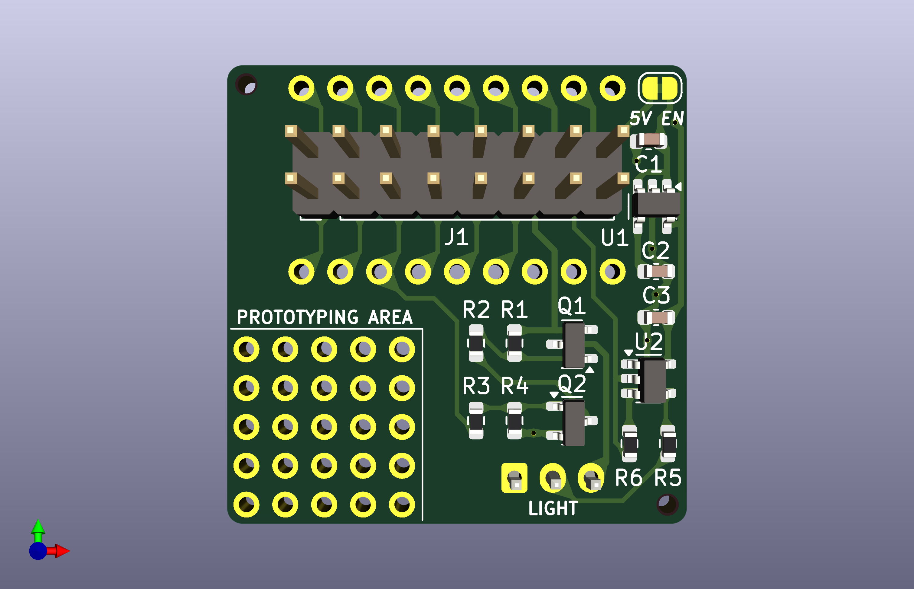
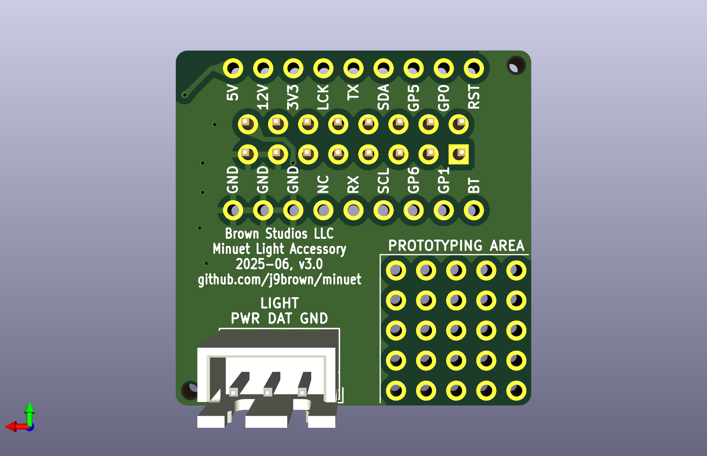

# Minuet light accessory v3.0

**Status: UNDER DEVELOPMENT**

The Minuet light accessory lets you attach a light to your fan.

Suggested applications:

- Attach a dimmable LED light (or other resistive load) with PWM or ON/OFF control.
- Attach an addressable LED strip (WS2811, WS2812B, WS2814, SK6812, or similar), attach it to the inside of the fan cowling to make it light up pretty colors.
- Use the accessory as a breakout board with access to all of the GPIO expansion port signals and power for making your own devices.

Depending on your application, you may need to modify your Minuet ESPHome firmware YAML configuration to control the loads in the manner you desire.

## Design synopsis

The board consists of a high side P-Channel MOSFET driver and a 5 V voltage shifter.  Using a high side driver ensures there is a common ground reference which is necessary for driving addressable LED lights.

The on-board 5 V voltage regulator has an extremely small quiescent current: 71 uA with no load, 750 uA at full load so it won't drain your battery.

The board is laid out to be amenable to hand soldering.  The components are fairly small to fit within the allotted space but the pads are fully exposed.

The board gets its power from the Minuet fan controller board.  Please consider these specifications to appropriately size your loads to the available supply.

- 12 V supply is unregulated, 1 A current available
- 5 V supply is regulated, 150 mA current available
- 3.3 V supply is regulated, 600 mA current available

The board includes a small prototyping area of 0.1" (2.54 mm) pitch through-hole pads for building your own circuits.

[View the schematics in PDF format](light.pdf)

## Circuit board

## Installation

Make sure your light is designed for 12 V!

Turn off power to the fan while making these connections.

Connect the light to the [JST XH](https://www.jst.com/wp-content/uploads/2021/01/eXH-new.pdf) port labeled `LIGHT`.  Refer to the labels on the circuit board for the correct orientation.

- pin 1 labeled `GND` is ground
- pin 2 labeled `DAT` is 5 V data, controlled by `GPIO5`, 32 mA maximum output current
- pin 3 labeled `PWR` is 12 V power, controlled by `GPIO6`, 1 A maximum output current

When attaching a dimmable LED light, you only need to connect power and ground to the light; leave the data pin unconnected.

When attaching an addressable LED strip, you need to connect power, data, and ground to the strip.

Plug the accessory into the Minuet `EXPANSION PORT`.  Take care that the pins are aligned with the socket.

## Usage

Refer to the [user guide](../../../docs/user-guide.md) for how to operate the light accessory using the fan's keypad or an infrared remote.

## The 12 V supply is unregulated

The 12 V supply is unregulated and will reflect the voltage of whatever the fan is connected to, such as a battery whose voltage may vary by a few volts as it charges and discharges.

Typically, LED lights won't mind being driven a few volts more or less than 12 V but they will dissipate more heat at higher voltages and could potentially be damaged if operated as full brightness that way for a long time.

If you need voltage regulation for your load, consider connecting a 12 V DC buck-boost converter either upstream of the fan or downstream of the power terminal.

## How many addressable LED pixels can I use?

It depends on the LED strip that you use.  Here's some general guidance.  If you're not already familiar with addressable LEDs, I suggest looking for a more thorough tutorial.

As a rough estimate, a typical RGB LED pixel draws 0.3 W when red, green, and blue are at full brightness and a typical RGBW LED pixel draws an extra 0.1 W when the white channel is also lit at full brightness.  It adds up quickly when you multiply by the number of pixels!

In practice, you can drive a lot more LEDs if you don't run them at full brightness.  If you run them at 50% intensity, they use about 1/4 the power, they're still plenty bright, and they will last longer because they produce less waste heat.

With the available 12 W of power from the `LIGHT` connector, you should be able to light about 40 RGB pixels at full brightness and many more when operated at a reduced brightness.  Plenty for lighting up the fan cowling or part of the ceiling.

Recommendation: Use RGBW addressable LED strips with a warm white or cold white channel to improve [color rendering](https://en.wikipedia.org/wiki/Color_rendering_index) when used for white light general illumination.  Mixing RGB to produce white without a dedicated white channel makes everything look weird.

## Errata

Nothing yet...
