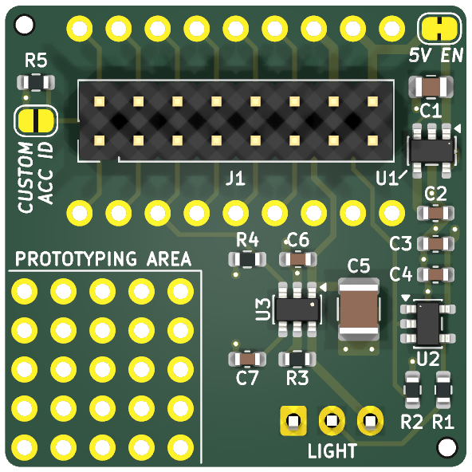
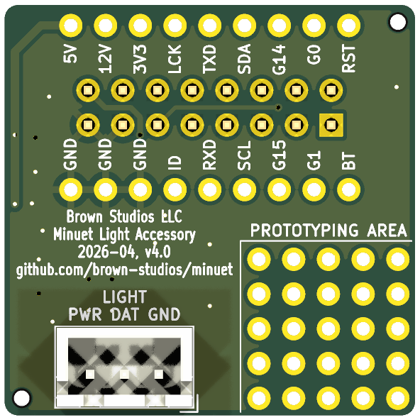

# Minuet light accessory v4.0

**Status: UNDER DEVELOPMENT, UNTESTED**

The Minuet light accessory attaches a ring of addressable LEDs to your fan.

## Design synopsis

The [TPS22810](https://www.ti.com/lit/ds/symlink/tps22810.pdf) high side load switch supplies power to the LEDs.  It can also be used to drive other loads but it's not intended to be used for PWM.

The [SN74LVC1G17](https://www.ti.com/lit/ds/symlink/sn74lvc1g17.pdf) buffer level shifts the addressable LED data signal to 5 V.

The [LP2985-50DBVR](https://www.ti.com/lit/ds/symlink/lp2985.pdf) linear voltage regulator provides the 5 V reference for the addressable LED data signal.  It can also supply up to 150 mA for other purposes.  The voltage regulator has an extremely small quiescent current so it won't drain your battery and you can cut the `5V EN` jumper to disable it entirely if you don't need it.

The board exposes the expansion port signals and includes a small prototyping area of 0.1" (2.54 mm) pitch through-hole pads for building your own circuits based on these components.

The board gets its power from the Minuet fan controller board.  Please consider these specifications to appropriately size your loads to the available supply.

- 12 V supply is unregulated, 1 A current available
- 5 V supply is regulated, 150 mA current available.
- 3.3 V supply is regulated, 600 mA current available

[View the schematics in PDF format](light.pdf)

## Circuit board

## Fabrication

Use the `JLCPCB fabrication toolkit` plug-in to generate files for JLCPCB.

Fabrication parameters:

- Material: 2 layers, FR4 TG135, ENIG, 1 oz outer copper
- Via covering: tented or plugged
- Min via hole size: 0.3 mm (default)
- Board outline tolerance: 0.2 mm (default)
- PCBA type: standard or economic
- Assembly side: top and bottom, or just the top if you plan to assemble the bottom connectors manually
- Edge rails: by JLCPCB
- Tooling holes: by customer
- Parts selection: by customer
- Solder paste: high temp (default)
- Conformal coating: optional (omit if board is intended to be used for prototyping)
  - Do not spray connectors

## Installation

Make sure your addressable LED light strip is designed for 12 V and uses 3-wire signaling (WS2812B, SK6812, or similar).  The official Minuet firmware assumes an SK6812 RGBW LED strip with 57 pixels.  You may need to customize the firmware if you attach something else.

Turn off power to the fan while making these connections.

Connect the light to the [JST XH](https://www.jst.com/wp-content/uploads/2021/01/eXH-new.pdf) port labeled `LIGHT`.  Refer to the labels on the circuit board for the correct orientation.

- pin 1 labeled `GND` is ground
- pin 2 labeled `DAT` is 5 V data, controlled by `GPIO14`, 32 mA maximum output current
- pin 3 labeled `PWR` is 12 V power, controlled by `GPIO15`, 1 A maximum output current

Plug the accessory into the Minuet `EXPANSION PORT`.  Take care that the pins are aligned with the socket.

## Usage

Refer to the [user guide](../../../docs/user-guide.md) for how to operate the light accessory using the fan's keypad or an infrared remote.

## Accessory identification

By default, this circuit board identifies itself to Minuet as a "light accessory" when plugged into the expansion port.  If you repurpose this circuit board for a different function, close the `CUSTOM ACC ID` solder jumper to prevent the firmware from automatically configuring the expansion GPIOs.

Refer to the [main board design](../../minuet/v4/design-and-errata.md) for details.

## The 12 V supply is unregulated

The 12 V supply is unregulated and will reflect the voltage of whatever the fan is connected to, such as a battery whose voltage may vary by a few volts as it charges and discharges.

Typically, LED lights won't mind being driven a few volts more or less than 12 V but they will dissipate more heat at higher voltages and could potentially be damaged if operated as full brightness that way for a long time.

If you need voltage regulation for your load, consider connecting a 12 V DC buck-boost converter either upstream of the fan or downstream of the power terminal.

## How many addressable LED pixels can I use?

It depends on the LED strip that you use.  Here's some general guidance.  If you're not already familiar with addressable LEDs, we suggest looking for a more thorough tutorial.

As a rough estimate, a typical RGB LED pixel draws 0.3 W when red, green, and blue are at full brightness and a typical RGBW LED pixel draws an extra 0.1 W when the white channel is also lit at full brightness.  It adds up quickly when you multiply by the number of pixels!

In practice, you can drive a lot more LEDs if you don't run them at full brightness.  If you run them at 50% intensity, they use about 1/4 the power, they're still plenty bright, and they will last longer because they produce less waste heat.

With the available 12 W of power from the `LIGHT` connector, you should be able to light about 40 RGB pixels at full brightness and many more when operated at a reduced brightness.  Plenty for lighting up the fan cowling or part of the ceiling.

Recommendation: Use RGBW addressable LED strips with a warm white or cold white channel to improve [color rendering](https://en.wikipedia.org/wiki/Color_rendering_index) when used for white light general illumination.  Mixing RGB to produce white without a dedicated white channel makes everything look weird.

## Errata

Nothing yet...

## Changelog

Changes in v4.0:

- Replace the P-channel MOSFET output driver with a load switch.  It is more energy efficient, uses fewer components, and costs less to assemble.
- Update expansion port signals and add accessory identification resistor.
- Increase bulk capacitor physical size to compensate for DC bias derating.
- Adjust fabrication parameters: board edge clearance, silkscreen height
