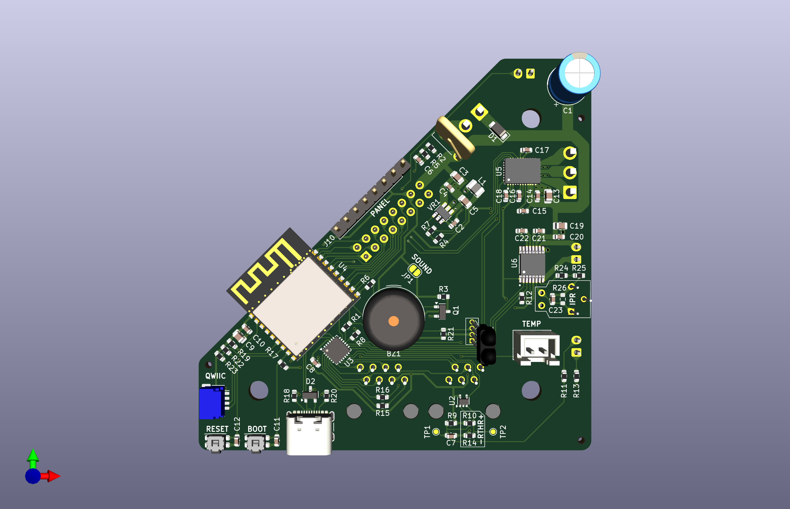
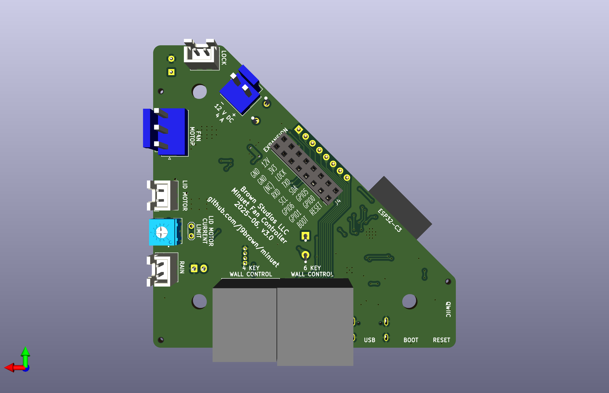

# Minuet hardware v3.0 (UNDER DEVELOPMENT)

**Status: UNDER DEVELOPMENT**

Minuet v3 is a feature complete replacement for the Maxxfan circuit board.  Minuet integrates a brushless DC fan motor driver with field-oriented control optimized for quiet operation and it has a microcontroller with built-in WiFi for home automation.

## Design synopsis

The microcontroller is an [ESP32-C3](https://www.espressif.com/sites/default/files/documentation/esp32-c3-wroom-02_datasheet_en.pdf) with 4 MB of flash, a single core, and an integrated 2.4 GHz antenna.  It is ample for running ESPHome.

The fan motor driver is a [MCF8316D](https://www.ti.com/lit/ds/symlink/mcf8316d.pdf).  It supports sensorless brushless DC motors with field oriented control with current limiting, built-in motor parameter estimation, and I2C interface.  The integrated buck converter is disabled as per this [application note](https://www.ti.com/lit/an/slla643/slla643.pdf).

The lid motor driver is a [DRV8876](https://www.ti.com/lit/ds/symlink/drv8876.pdf).  It has built-in current limiting which is used to detect stalls at the end-of-travel when the lid is completely opened or closed.

The [TCA9555](https://www.ti.com/lit/ds/symlink/tca9555.pdf) IO expander on-board provies an 16 additional IO pins with built-in pull-up resistors via I2C.

The [TPS561201](https://www.ti.com/lit/ds/symlink/tps561201.pdf) buck converter supplies 1 A at 3.3 V.  It is optimized for high efficiency at low current consumption to minimize vampire drain while the fan is turned off and the ESP32-C3 is in a low power state.

The [TSOP39238](https://www.vishay.com/docs/82778/tsop392.pdf) IR receiver supports the Maxxfan IR remote control.

The `EXPANSION` port enables accessories and factory programming.  It exposes four free GPIO pins that can be used for any purpose, the serial port, the I2C bus, the safely lock signal, the reset and bootloader signals, and the 3.3 V and 12 V power rails.  For example, with just a few components you could use the GPIO expansion port to attach an addressable LED strip for fancy lighting around the fan enclosure.

The `QWIIC` port allows readily available I2C accessories (such as environmental sensors) to be connected with ease.

The `THERMISTOR` port connects to the Maxxfan's built-in thermistor for use by the automatic thermostat.

The `RAIN` port connects to the Maxxfan's rain sensor (only certain models).  It has a high impedance input and uses a comparator to detect a small current flowing through water on the sensor.

The `LOCK` port triggers a safety lock function that stops the fan, closes the lid, and inhibits operation.

The USB C port and the `BOOT` and `RESET` tactile switches are used for accessing the bootloader and programming the firmware.

A simple voltage divider measures the supply voltage and triggers a software-controlled low battery protection function.

A piezo buzzer provides audible feedback.  Minuet aims to be polite about its use of audible feedback.  It can be configured in software or disabled in hardware by cutting a jumper trace.

[View the schematics in PDF format](minuet.pdf)

## Circuit board

## Recommended operational parameters

Recommended electrical supply specifications:

- Voltage: 12 V DC nominal and absolute maximum range from 9 to 16 V DC
- Wiring: minimum 18 AWG (0.8 mm²)
- Circuit protection: 5 A fuse or circuit breaker

Recommended motor specifications:

- Fan motor: Brushless DC motor rated for the supply voltage and constant operation, no hall sensors needed, driven with up to 4 A current per phase
- Lid motor: Brushed DC motor rated for the supply voltage and intermittent operation, can draw up to 2 A current

Please test your set up carefully and monitor heat dissipation if you choose to operate Minuet beyond these recommendations.

## PCB assembly

The KiCad project contains the bill of materials.  It includes part numbers and orientations of all SMT components for the JLCPCB PCBA service.

You will need advanced soldering skills to completely assemble this project by hand.  Although most of the components can be soldered by hand, a few parts have very fine pitch pads that are inaccessible from the sides.  You will need a solder stencil, fine solder paste, and a temperature controlled hot plate or a reflow oven.  The fan motor driver chip in particular must be carefully soldered to ensure an efficient thermal bond to the PCB.  You may find it easier to buy a board with the SMT components pre-assembled and then solder the remaining through-hole components by hand.  The IR receiver cannot be installed at the factory because it requires a standoff.

All of the SMT components are on the front side of the board.  They should be soldered first before moving on to the through hole components.

There are through hole components on both sides of the board.  Follow the silkscreen courtyard markings to determine the correct orientation.  Be aware that labels for connectors appear on both sides of the board.

The 1x8 pin header labeled PANEL must have a sufficient mating contact length to securely attach the keypad's flex connector.  The BOM specifies a part with an 8.1 mm mating contact length that works well.  Shorter contacts may be fine but the connector could come loose under vibration so be sure to check the fit.

The IR receiver must be raised above the board as far as the leads can be extended (about 16 mm) to be visible through the clear window in the keypad.  Thus the IR receiver will need mechanical support to keep it propped up and to insulate the leads.  You can 3D print a suitable standoff from [this model](https://cad.onshape.com/documents/11f07c0bb608e7010778ac35/w/a82f75dceda39e564795dbd4/e/5949b73994c9747af7d1d4c9) or make your own using other materials such as cardboard.

There are test points on the board near the lid motor current limit trim potentiometer to help you measure the resistance as you make adjustments.

You can safely omit certain components that you don't need including the IR receiver, the 6P6C and 8P8C connectors for wired wall controls, the rain sensor circuitry, the buzzer, and the current limit trim potentiometer (if you add a fixed resistor instead).

To improve the circuit board's moisture resistance, you can spray it with an insulative conformal coating after taking care to mask off all connectors before spraying so they don't get coated unintentionally.

## Setup

### Temperature sensor

Connect the Maxxfan's temperature sensor to the `THERMISTOR` port.  You can make your own temperature sensor connecting any 10 Kohm NTC thermistor to a JST XH-2 plug in any orientation.  Update the thermistor beta constant in the firmware to ensure accurate readings.

The temperature sensor is driven by an IO pin to minimize resistive self-heating and power usage between samples.  The Maxxfan's built-in thermistor appears to have a beta constant of 3950.

### Rain sensor

Connect the Maxxfan's rain sensor to the `RAIN` port.  You can make your own rain sensor by mounting two wires to a surface that's exposed to the rain such that water will form a conductive path between them.  Connect the wires to a JST XH-2 plug in any orientation.

The rain sensor circuit uses a comparator to detect a small current flowing between bare electrodes immersed in water.  The circuit has high impedance to protect itself from the environment especially because it is DC coupled to the sensing electrodes (just like the original equipment).

You can omit the comparator and other rain sensor components if you don't need the rain sensor.  Alternatively, you could repurpose the `RAIN` port for a button input or conductive touch sensor.

In a subsequent revision, it might be interesting to explore AC coupling the rain sensor to improve isolation or removing the comparator to reduce the BOM.

### Safety lock

Connect a switch to the `LOCK` port with a JST XH-2 plug to trigger a safety lock function that that stops the fan, closes the lid, and inhibits operation.  You can connect several switches in parallel to inhibit operation under a multitude of external conditions.

Here are some suggested applications:

- Attach a magnet to your vent fan insulating cover and a normally-open reed switch connected to the `LOCK` port somewhere in the fan trim ring or ceiling to inhibit operation while the insulating cover is installed.
- Connect a relay or optocoupler to inhibit operation of the fan while the engine is running.
- Refer to the [user guide](../../../docs/setup-guide.md) for details.

Pin 1 is ground.  Pin 2 is a digital input with a pull-up to 3.3 V.  The safety lock engages when pin 2 is low (tied to ground) and disengages when pin 2 is floating.

### Piezo buzzer

The piezo buzzer is designed with politeness in mind which may be a matter of personal preference.

You can customize or disable the sounds it makes in software.  Refer to the [setup guide](../../../docs/setup-guide.md) for details.

You can disable the buzzer altogether in hardware by cutting the `SOUND` jumper trace on the board.  Alternatively, if you want to make the buzzer louder, then you can cut the jumper and solder a wire from the buzzer side of the `SOUND` jumper to the 12 V bus.

And if you want to make the fan play a cheerful jingle any time it turns on then you can change the firmware to do that with [RTTTL](https://en.wikipedia.org/wiki/Ring_Tone_Text_Transfer_Language).

### Fan motor

Connect a suitably rated brushless motor to the `FAN MOTOR` port with a JST VH-3 plug.  Pin 1 is phase A, pin 2 is phase B, pin 3 is phase C.  If the motor operates in the reverse direction than you expect, simply swap any two phases.

Configure the motor parameters in the software.  Refer to the [setup guide](../../../docs/setup-guide.md) for details.

The [MCF8316D](https://www.ti.com/lit/ds/symlink/mcf8316d.pdf)] is configured to mostly be controlled and monitored over I2C instead of spending precious GPIOs on control signals.  The buck converter is disabled because it isn't needed.  This board is not compatible with any other versions of the MCF8316.

### Lid motor

Connect the Maxxfan's lid motor to the `LID MOTOR` port with a JST XH-2 plug.  Refer to the [setup guide](../../../docs/setup-guide.md) for details on how to construct a suitable adapter.

Minuet detects when the lid motor has reached the end of its travel when opening or closing the lid when the lid motor driver reports an overcurrent fault or after a fixed duration of time has elapsed.

The lid motor current limit must be set high enough to ensure that the motor has enough torque to overcome the friction of the lift mechanism.  And ideally it should be low enough to reliably detect the lid motor stall at end of travel.  The safe default current limit ensures sufficient torque for sticky motors but it may cause Minuet to wait until the timeout to report the completion of lid motor travel.

If your lid does not open or close fully, try increasing the lid motor current limit a little bit.  Or if your lid motor moves freely, you can try reducing the default to more reliably detect end of travel.

The `IPROPI` pads set the current limit either using a fixed resistor or a 5 Kohm variable resistor.  To set this value, measure the resistance across the variable resistor at the test point near `IPROPI` and turn the potentiometer until you obtain the desired setpoint.

Formulas to calculate the current limit where `RV` is the value of the `IPROPI` resistor in ohms.

- Itrip = 1000 * 3.3 V / RV
- RV = 1000 * 3.3 V / Itrip

**Safe default: RV = 2.21 Kohms, Itrip = 1.5 A**
**Recommended setting: RV = 2.80 Kohms, Itrip = 1.18 A**

The [DRV8876](https://www.ti.com/lit/ds/symlink/drv8876.pdf) data sheet recommends adding a small value capacitor such as 10 nF to `IPROPI` to reduce glitches if faults are detected prematurely.  It might be possible to adjust the value of this capacitor to a larger value to delay premature faults for a sticky motor that needs more current to get moving.  Alternatively, `IMODE` could be configured to apply fixed off-time current chopping (but it will prevent end of travel detection).

### Expansion port

Connect Minuet accessories to the `EXPANSION` header.  Refer to the [setup guide](../../../docs/setup-guide.md) for details.

And you can make your own accessories too!

The `EXPANSION` header includes the following signals.  Refer to the Minuet schematics or the board silkscreen for the complete pinout.

- `GPIO0`, `GPIO1`, `GPIO5`, `GPIO6` can be used for any purpose
- `UART_RXD` and `UART_TXD` provide the serial port
- `SCL` and `SDA` provide the I2C bus (QWIIC)
- `RESET` and `BOOT` are wired in parallel with their corresponding buttons (active low)
- `LOCK` engages the safety lock (active low)
- 12 V supply is unregulated, 1 A current available
- 3.3 V supply is regulated, 600 mA current available
- Ground

The accessory PCB should be no larger than 30 mm x 30 mm to ensure it fits within the housing.  It has a 16-pin 2-row pin header with 2.54 mm pitch centered 7.5 mm from the upper edge edge.  Refer to the [light accessory](../../light) as an example for the connector placement and PCB layout.

One pin on the expansion port is not connected to anything and it is labeled *(NC)* on the silkscreen.  This pin might be used for something in a future version of Minuet so please don't connect anything to it.

### QWIIC port

Connect [QWIIC](https://www.sparkfun.com/qwiic) peripherals to the `QWIIC` port, such as environmental sensors, to this port.  Refer to the [setup guide](../../../docs/setup-guide.md) for details.

## IO pins

The ESP32-C3 microcontroller has relatively few GPIOs so they are assigned to components that need specific functions first and the remaining pins are assigned to the expansion port.

- `GPIO0` & `GPIO1`: Reserved for the GPIO expansion port (IO, ADC, LEDC PWM, 32 kHz XTAL, and more functions)
- `GPIO2`: IR receiver (RMT function), strapping pin
- `GPIO3`: Voltage sensor (ADC function)
- `GPIO4`: Thermistor (ADC function)
- `GPIO5` & `GPIO6`: Reserved for the GPIO expansion port (IO, LEDC PWM, and more functions)
- `GPIO7`: I2C SDA
- `GPIO8`: I2C SCL, strapping pin
- `GPIO9`: BOOT button, strapping pin
- `GPIO10`: Buzzer (LEDC PWM function)
- `GPIO18` & `GPIO19`: USB full-speed transceiver
- `GPIO20` & `GPIO21`: Serial port UART

The TCA9555 IO expander handles the remaining low speed digital logic functions.  These pins are designated `XIO` on the schematic.  All of the `XIO` pins have been assigned to peripherals.  Refer to the schematics for details.

## Changes from v2

- New BLDC fan motor driver with field-oriented control optimized for quiet operation
  - All fan motor parameters are programmed in software via I2C; no more jumpers
  - Works with sensorless BLDC motors
  - Directly governs the fan rotor speed (instead of the motor duty cycle as before)
- Added a safely lock signal to stop the fan, close the lid, and inhibit operation
  - When paired with a normally-open reed switch, Minuet can detect when an insulating cover is installed and engage the safety lock until it is removed
- Optimized the bill of materials for fabrication by JLCPCB PCBA
- Marked the schematic with the voltage ratings of the actual parts instead of the minimum necessary
- Improved the left-to-right reading order of the schematic
- Moved all of the components except some connectors and the trim pot to the front side of the board to best take advantage of LCSC single-sided economic PCBA although it would perhaps be better to keep the PTC fuse on the back side (facing up when installed) for improved free air convection

## Errata

Issues in v3.0:

- There should be a 1 uF capacitor from FB_BK to GND_BK according to the MCF8316 datasheet (although it works fine without it).
- Should add motor phase labels to the silkscreen for clarity and relabel all of the documentation to A/B/C to match the data sheet.
- The rain sensor does not work.  The Minuet v3.0 boards were assembled with LMV331IDCK which has a PNP input stage and only allows a common mode input voltage up to Vcc - 0.7 V = 2.6 V whereas the actual signals are in the range of 3.1 V.  The Minuet v2.* boards used LMV331X which has no such limitation and worked as expected (but this part was not available at JLCPCB).  Suitable rail-to-rail alternatives: TL331LV, TLV7041, TLV7021.
- Some areas of the PCB reach over 50 C when operating the motor at 4 A peak per phase.  At 4.5 A, we can see over-temperature warnings.  Consider adding a copper pour to the front layer with thermal vias.
- The bootloader enables the GPIO6 pull-up on reset which interferes with its use for the Minuet light accessory board and causes the LED strip to be powered on prematurely.  Should swap GPIO6 and GPIO7 (SDA) because we need the pull-up on SDA anyhow.  Workaround by setting EFUSE_DIS_PAD_JTAG = 1.

    `espefuse.py --chip esp32c3 --port /dev/tty.usbmodem11201 burn_efuse DIS_PAD_JTAG`
