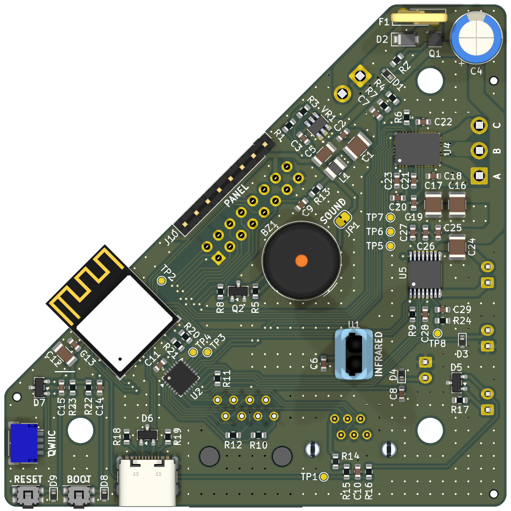
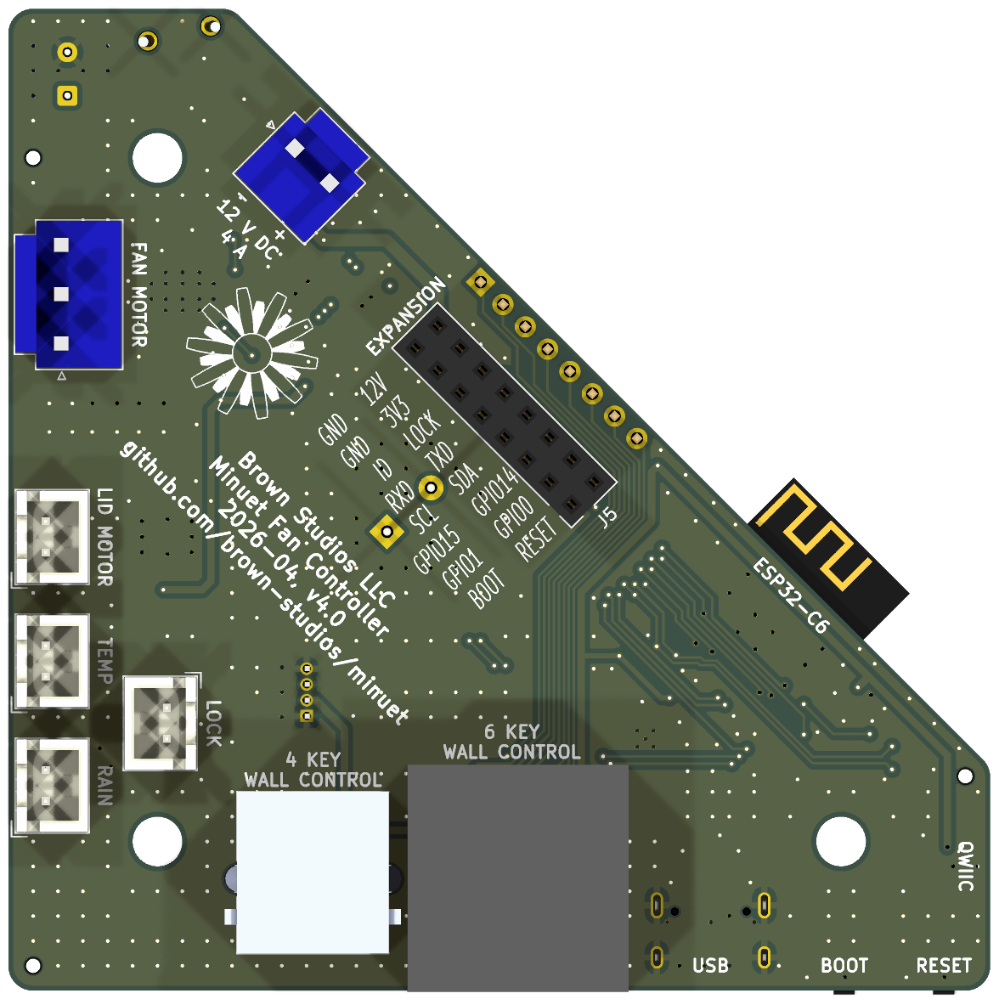

# Minuet v4.0

**Status: UNDER DEVELOPMENT, UNTESTED**

The Minuet fan controller circuit board upgrades the Maxxfan with a quiet brushless fan motor driver and home automation features.

## Design synopsis

The microcontroller is an [ESP32-C6-MINI-1](https://documentation.espressif.com/esp32-c6-mini-1_mini-1u_datasheet_en.pdf) with 8 MB of flash, 160 MHz CPU, WiFi 802.11ax, Bluetooth 5 LE, Zigbee/Thread, and an integrated 2.4 GHz antenna.  It is ample for running ESPHome and low power.  Documentation: [Technical reference manual](https://documentation.espressif.com/esp32-c6_technical_reference_manual_en.pdf)

The fan motor driver is a [MCF8316D](https://www.ti.com/lit/ds/symlink/mcf8316d.pdf).  It supports sensorless brushless DC motors with field oriented control with current limiting, built-in motor parameter estimation, and I2C interface.  The integrated buck converter is disabled as per this [application note](https://www.ti.com/lit/an/slla643/slla643.pdf).

The lid motor driver is a [DRV8876](https://www.ti.com/lit/ds/symlink/drv8876.pdf).  It has built-in current sensing which is used to detect stalls at the end-of-travel when the lid is completely opened or closed.

The [TCA9555](https://www.ti.com/lit/ds/symlink/tca9555.pdf) IO expander on-board provies an 16 additional IO pins with built-in pull-up resistors via I2C.

The [TPS561201](https://www.ti.com/lit/ds/symlink/tps561201.pdf) buck converter supplies 1 A at 3.3 V.  It is optimized for high efficiency with pulse skipping for low power operation.

The [TSOP39238](https://www.vishay.com/docs/82778/tsop392.pdf) IR receiver supports the Maxxfan IR remote control.

The `EXPANSION` port enables accessories and factory programming.  It exposes GPIOs, the serial port, the I2C bus, the safely lock signal, the reset and bootloader signals, and the 3.3 V and 12 V power rails.  You can make your own accessories to plug into this port.

The `QWIIC` port allows readily available I2C accessories to be connected with ease.

The `TEMP` port connects to the Maxxfan's built-in thermistor for use by the automatic thermostat.

The `RAIN` port connects to the Maxxfan's rain sensor (only certain models).

The `LOCK` port triggers a safety lock function that stops the fan, closes the lid, and inhibits operation.

The USB-C port and the `BOOT` and `RESET` tactile switches are used for accessing the bootloader and programming the firmware.

A simple voltage divider measures the supply voltage and triggers a software-controlled low battery protection function.

A piezo buzzer provides audible feedback.  Minuet aims to be polite about its use of audible feedback.  It can be configured in software or disabled in hardware by cutting the `SOUND` jumper trace.

[View the schematics in PDF format](minuet.pdf)

## Circuit board

## Recommended operational parameters

Recommended electrical supply specifications:

- Voltage: 12 V DC nominal and absolute maximum range from 9 to 16 V DC
- Wiring: minimum 18 AWG (0.8 mm²)
- Circuit protection: 5 A fuse or circuit breaker

Recommended motor specifications:

- Fan motor: Brushless DC motor rated for the supply voltage and continuous duty, no hall sensors needed, driven with up to 4 A current per phase
- Lid motor: Brushed DC motor rated for the supply voltage and intermittent duty, can draw up to 2 A current

Please test your set up carefully and monitor heat dissipation if you choose to operate Minuet beyond these recommendations.

## PCB assembly

The KiCad project contains the bill of materials.  It includes part numbers and orientations of all SMT components for the JLCPCB PCBA service.

You will need advanced soldering skills if you assemble this project by hand.  Several parts have very fine pitch pads that are inaccessible from the sides and require a solder stencil, fine solder paste, and a temperature controlled hot plate or a reflow oven.  The fan motor driver chip in particular must be carefully soldered to ensure an efficient thermal bond to the PCB.

All of the SMT components are on the front side of the board.  They should be soldered first before moving on to the through hole components.

There are through hole components on both sides of the board.  Follow the silkscreen courtyard markings to determine the correct orientation.

The 1x8 pin header labeled `PANEL` must have a sufficient mating contact length to securely attach the keypad's flex connector.  The BOM specifies a part with an 8.1 mm mating contact length that works well.  Shorter contacts may be fine but the connector could come loose under vibration so be sure to check the fit.

The IR receiver must be raised above the board as far as the leads can be extended (about 16 mm) to be visible through the clear window in the keypad.  Thus the IR receiver will need mechanical support to keep it propped up and to insulate the leads.  You can 3D print a suitable standoff from [this model](https://cad.onshape.com/documents/11f07c0bb608e7010778ac35/w/a82f75dceda39e564795dbd4/e/5949b73994c9747af7d1d4c9) or make your own using other materials such as cardboard.

You can safely omit certain components that you don't need including the IR receiver, the 6P6C and 8P8C connectors for wired wall controls, the rain sensor circuitry, and the piezo buzzer.

To improve the circuit board's moisture resistance, you can spray it with an insulative conformal coating after taking care to mask off all connectors before spraying so they don't get coated unintentionally.

## Fabrication

Use the `JLCPCB fabrication toolkit` plug-in to generate files for JLCPCB.

Fabrication parameters:

- Material: 4 layers, FR4 TG155, ENIG, 1 oz outer copper, 0.5 oz inner copper
- Via covering: plugged
- Min via hole size: 0.3 mm (default)
- Board outline tolerance: 0.2 mm (default)
- Assembly side: top and bottom, or just the top if you plan to assemble the bottom connectors manually
- Tooling holes: by customer
- Parts selection: by customer
- Solder paste: high temp (default)
- Conformal coating: both sides
  - Do not spray connectors
  - Do not spray U1 pads (infrared receiver will be assembled later)
  - Do not spray BZ1 sound hole

## Setup

### Temperature sensor

Connect the Maxxfan's temperature sensor to the `TEMP` port.  You can make your own temperature sensor connecting any 10 Kohm NTC thermistor to a JST XH-2 plug in any orientation.  Update the thermistor beta constant in the firmware to ensure accurate readings.

The temperature sensor is driven by an IO pin to minimize resistive self-heating and power usage between samples.  The Maxxfan's built-in thermistor appears to have a beta constant of 3950.

### Rain sensor

Connect the Maxxfan's rain sensor to the `RAIN` port, if your unit has one.

If your unit doesn't have a rain sensor, then you probably don't need one because the lid cover already keeps the water out and it is safe to operate the fan in the rain.  To experiment with the rain sensor function, you can buy an OEM replacement rain sensor or make your own rain sensor by mounting two parallel wires to a surface that's exposed to the rain such that water drops will form a conductive path between them.  Connect the wires to a JST XH-2 plug in any orientation.

The rain sensor circuit uses the ADC to detect a small current flowing between bare electrodes immersed in water.  The circuit has high impedance and ESD protection diodes to protect itself from the environment.

### Safety lock

Connect a switch to the `LOCK` port with a JST XH-2 plug to trigger a safety lock function that that stops the fan, closes the lid, and inhibits operation.  You can connect several switches in parallel to inhibit operation under a multitude of external conditions.

Here are some suggested applications:

- Attach a magnet to your insulated vent cover and a normally-open reed switch connected to the `LOCK` port somewhere in the fan trim ring or ceiling to inhibit operation while the insulated vent cover is installed.
- Connect a relay or optocoupler to inhibit operation of the fan while the engine is running.

Pin 1 is ground.  Pin 2 is a digital input with a pull-up to 3.3 V.  The safety lock engages when pin 2 is low (tied to ground) and disengages when pin 2 is floating.

### Piezo buzzer

The piezo buzzer is designed with politeness in mind which may be a matter of personal preference.

You can customize or disable audible feedback in the device settings or firmware.

You can physically disable the buzzer in hardware by cutting the `SOUND` jumper trace on the board.

And if you want to make the fan play a cheerful jingle then you can change the firmware to do that using [RTTTL](https://en.wikipedia.org/wiki/Ring_Tone_Text_Transfer_Language).

### Fan motor

Connect a suitably rated brushless motor to the `FAN MOTOR` port with a JST VH-3 plug.  Pin 1 is phase A, pin 2 is phase B, pin 3 is phase C.  If the motor operates in the reverse direction than you expect, simply swap any two phases.

Configure the motor parameters in the firmware.

The [MCF8316D](https://www.ti.com/lit/ds/symlink/mcf8316d.pdf)] is configured to mostly be controlled and monitored over I2C instead of spending precious GPIOs on digital logic signals.  The buck converter is disabled because it isn't needed.  Minuet is not compatible with any other revisions of the MCF8316 chip because they have substantially different register layouts.

Note: The MCF8316D has a [known issue](https://e2e.ti.com/support/motor-drivers-group/motor-drivers/f/motor-drivers-forum/1555307/mcf8316d-brake-triggers-watchdog_fault-when-watchdog-is-enabled/5991916) that causes a spurious watchdog timeout when tickling the watchdog over I2C.  Minuet uses the external watchdog pin to tickle the watchdog as a workaround.

### Lid motor

Connect the Maxxfan's lid motor to the `LID MOTOR` port with a JST XH-2 plug.

The lid motor driver automatically limits the motor current using current chopping with a fixed off-time.  If the current exceeds the driver chip's fixed overcurrent threshold (3.5 A to 5 A), the motor driver reports an overcurrent fault and latches the output off to prevent damage.  An overcurrent fault may indicate a physical problem with the motor or other components.

The lid motor draws current proportional to the work it must do to move the lid.  As the lid begins to move, the motor draws more current to overcome friction and inertia in the mechanism, then the current reduces as the lid moves towards its final position, and finally the current increases dramatically once the lid reaches its end of travel and the motor stalls.

The Maxxfan does not have a limit switch to sense when the lid has reached end of travel so Minuet monitors the lid motor current and waits for the current to exceed a programmed stall current threshold `I_STALL` for a certain period of time then stops the motor.

The DRV8876 produces a current at the `I_PROPI` pin in proportion to the motor current.  The `R_PROPI` resistor transforms the current into a voltage called `V_PROPI`.  When the voltage at `V_PROPI` reaches `V_REF`, the motor current has exceeded the trip current `I_TRIP` and DRV8876 performs current chopping.  Minuet monitors the motor current by sensing the voltage at `V_PROPI` with an ADC.

Let's determine the appropriate values for `V_REF` and `R_PROPI`.

First we consider the range of the ADC.  According to the datasheet, the ESP32-C6 ADC has an calibrated measurement range of 0 to 3300 mV with +/- 40 mV error when sampled with 12 dB attentuation.  For this application, Minuet only needs to detect when the value exceeds a coarsely defined stall current threshold (perhaps set `I_STALL` to be 80% of `I_TRIP`) and absolute precision near the ends of the range isn't important.  So for convenience, we can set `V_REF` to 3.3 V.

Next we consider the trip current for current limiting, `I_TRIP`.  The Maxxfan lid motor (P/N 10-20270) needs about 300 mA at 12 V to start moving, draws less than 100 mA while coasting to a closed position, may draw as much as 600 mA or more when it encounters significant resistance, and may draw more current to operate with increasing age and wear.  The maximum current rating of the motor is unknown but it does not appear to be damaged when driven with 1.5 A for a few seconds.  For convenience, choose `I_TRIP` to 1 A and set `I_STALL` to 800 mA.

`R_PROPI` = 1000 * `V_REF` / `I_TRIP` = 1000 * 3.3 V / 1 A = 3.3 Kohm

If your lid motor stalls prematurely while opening or closing the lid, try cleaning the motor first.  If that doesn't help, try increasing the `I_STALL` threshold in the firmware.  If all else fails, you can try increasing `I_TRIP` to 1.5 A by reducing `R_PROPI` to 2.21 Kohm.

### Expansion port

Connect Minuet accessories to the `EXPANSION` header.

And you can make your own accessories too!

The `EXPANSION` header includes the following signals.  Refer to the Minuet schematics or the circuit board silkscreen for the complete pinout.

- `GPIO0`, `GPIO1`, `GPIO14`, `GPIO15` can be used for any purpose
- `UART_RXD` and `UART_TXD` provide the serial port
- `I2C_SCL` and `I2C_SDA` provide the I2C bus (QWIIC)
- `RESET` and `BOOT` are wired in parallel with their corresponding buttons (active low)
- `LOCK` engages the safety lock (active low)
- `ACC_ID` [identifies the accessory](#accessory-identification) that is plugged into the expansion port (see below)
- 12 V supply is unregulated, 1 A current available
- 3.3 V supply is regulated, 600 mA current available
- Ground

The accessory PCB should be no larger than 30 mm x 30 mm to ensure it fits within the housing.  It has a 16-pin 2-row pin header with 2.54 mm pitch centered 7.5 mm from the upper edge.

> [!TIP]
> Refer to the [light accessory](../../light) as an example for the connector placement and PCB layout.  And by closing the custom accessory ID solder jumper, you can also repurpose the circuit board to build custom accessories with the provided signal pin breakout and prototyping area.

### Accessory identification

Minuet needs to identify which accessory is plugged into the expansion port so it can configure the expansion port GPIO pins and ESPHome entities correctly.  On boot, the firmware measures the voltage of the `ACC_ID` pin with an ADC channel and sets things up accordingly.

The `ACC_ID` pin forms the center terminal of a voltage divider.  The Minuet main circuit board has a `100K` resistor from `ACC_ID` to the 3.3 V supply.  The accessory circuit board identifies itself with a resistor `R_ACC_ID` from `ACC_ID` to ground as shown in the following table.  Use resistors with 1% tolerance to ensure accurate identification and allow for future expansion.

| ID | Accessory resistor (`R_ACC_ID`) | Voltage at `ACC_ID` | Usage |
| -- | ------------------------------- | ------------------- | ----- |
| 0  | none (open circuit)             | 3.3 V               | no accessory connected |
| 1  | 0 ohm (short circuit)           | 0 V                 | custom accessory |
| 2  | 100 Kohm +/- 1%                 | 1.65 V              | light accessory |
| 3  | 68 Kohm +/- 1%                  | 1.34 V              | reserved |
| 4  | 47 Kohm +/- 1%                  | 1.06 V              | reserved |
| 5  | 33 Kohm +/- 1%                  | 0.82 V              | reserved |
| 6  | 22 Kohm +/- 1%                  | 0.60 V              | reserved |
| 7  | 15 Kohm +/- 1%                  | 0.43 V              | reserved |
| 8  | 10 Kohm +/- 1%                  | 0.30 V              | reserved |
| 9  | 150 Kohm +/- 1%                 | 1.98 V              | reserved |
| 10 | 220 Kohm +/- 1%                 | 2.27 V              | reserved |
| 11 | 330 Kohm +/- 1%                 | 2.53 V              | reserved |
| 12 | 470 Kohm +/- 1%                 | 2.72 V              | reserved |

If you are developing a custom accessory for personal use, connect `ACC_ID` to ground to prevent the firmware from attempting to configure the accessory itself because your own customized ESPHome YAML configuration will take care of it.  We recommend using a zero ohm resistor so you can change the ID later.

If you are developing an accessory for broader distribution, please open an issue in the Minuet firmware repository to allocate an ID for your accessory and provide an accessory driver to ensure a convenient plug-and-play experience for end-users.

> [!NOTE]
> We decided to use a resistor for accessory identification to keep it simple for folks who want to design their own expansion port accessories.  We also considered using an I2C EEPROM to store identification and configuration information but it didn't seem necessary.

### QWIIC port

Connect [QWIIC](https://www.sparkfun.com/qwiic) peripherals to the `QWIIC` port, such as environmental sensors, to this port.

## Details

### IO pins

The ESP32-C6 microcontroller pins are assigned to usages that need special functions.  The expansion port pins have been chosen to have relatively few constraints on their usage to ease accessory development.

| Pin    | Usage                    | Reset state | Function | Remarks |
| ------ | -----------------------  | ----------- | -------- | ------- |
| GPIO0  | Expansion port           | floating    | GPIO, ADC, XTAL+, etc. | |
| GPIO1  | Expansion port           | floating    | GPIO, ADC, XTAL-, etc. | |
| GPIO2  | Rain sensor              | floating    | ADC | |
| GPIO3  | Thermistor               | floating    | ADC | |
| GPIO4  | Lid motor current sensor | floating    | ADC | JTAG MTMS, strapping pin (irrelevant because SDIO not used) |
| GPIO5  | Voltage sensor           | floating    | ADC | JTAG MTDI, strapping pin (irrelevant because SDIO not used) |
| GPIO6  | Accessory ID             | pull-up     | ADC | JTAG MTCK, internal pull-up active on boot unless EFUSE_DIS_PAD_JTAG = 1 |
| GPIO7  | Piezo buzzer             | floating    | LEDC PWM | JTAG MTDO |
| GPIO8  | I2C data                 | floating    | I2C SDA | external pull-up, strapping pin (high to allow download mode) |
| GPIO9  | BOOT button              | floating    | GPIO | external pull-up, strapping pin (select boot / download mode) |
| GPIO12 | USB data                 | floating    | USB D- | |
| GPIO13 | USB data                 | pull-up     | USB D+ | |
| GPIO14 | Expansion port           | floating    | GPIO, etc. | |
| GPIO15 | Expansion port           | floating    | GPIO, etc. | strapping pin (irrelevant because EFUSE_JTAG_SEL_ENABLE = 0) |
| GPIO16 | Console serial port TX   | pull-up     | UART0 TX | |
| GPIO17 | Console serial port RX   | pull-up     | UART0 RX | |
| GPIO18 | I2C clock                | pull-up     | I2C SCL | external pull-up |
| GPIO19 | IR receiver              | pull-up     | RMT | receiver has integrated pull-up |
| GPIO20 | Lid motor driver IN2     | pull-up     | GPIO | |
| GPIO21 | Lid motor driver IN1     | pull-up     | GPIO | |
| GPIO22 | Fan driver watchdog      | pull-up     | GPIO | |
| GPIO23 | Reserved for future use  | pull-up     | GPIO | |

The TCA9555 IO expander handles the remaining low speed digital logic functions.  These pins are designated with the `XIO` prefix in the schematics.  They have always-on internal 100 Kohm pull-ups and are configured as inputs at reset.

| Pin    | Usage                    | Remarks |
| ------ | -----------------------  | ------- |
| XIO0   | Keypad LED "auto"        | active low |
| XIO1   | Keypad LED "rain"        | active low |
| XIO2   | Keypad column 3          | |
| XIO3   | Keypad row 2             | |
| XIO4   | Keypad column 4          | |
| XIO5   | Keypad column 2          | |
| XIO6   | Keypad row 1             | |
| XIO7   | Keypad column 1          | |
| XIO8   | Safety lock              | active low |
| XIO9   | Thermistor power         | active high |
| XIO10  | Lid motor driver fault   | active low |
| XIO11  | Lid motor driver sleep   | active low |
| XIO12  | Fan motor driver fault   | active low |
| XIO13  | Fan motor driver wake    | active high |
| XIO14  | Reserved for future use  | |
| XIO15  | Reserved for future use  | |

Pins marked as reserved for future use are provided as test points on the circuit board.

### Capacitor DC bias derating

The ceramic bulk capacitors on the 12 V supply are sized to compensate for the loss of capacitance due to DC bias.  A typical 10 uF MLCC with a 12 V DC bias might be derated by as much as 80% in 0805 size but only by 25% in 1210 size so this design uses physically larger capacitors with an X5R or X7R dielectric for those applications.

### Via stitching pattern

The via stitching pattern is mostly generated with the `kicad-action-scripts` plug-in and additional vias added by hand where needed.  Stitching couples the inner ground planes and outer copper pours to reduce radiated emissions and improves thermal dissipation.

Parameters for the plug-in:

- Via copper size: 0.5 mm
- Via drill size: 0.3 mm
- Via clearance: 0.3 mm
- Via grid: 2.0 mm
- Net name: GND
- Pattern: rectangular

## Errata

Nothing yet...

## Changelog

Changes since v3:

- Replace the ESP32-C3 with an ESP32-C6 to alleviate GPIO scarcity and provide more options for radio connectivity.
- Use a 4 layer PCB with signal/ground/ground/signal stack-up, copper pours, and via stitching to improve thermal dissipation, power distribution, and EMC.
- Increase local bulk capacitance for the motor drivers taking DC bias derating into account.
- Add reverse polarity protection.
- Add ESD protection to external signals.
- Use the ADC to monitor the lid motor current to detect end of travel in software.
- Provide PWM signals to the lid motor driver to support soft start.
- Use the ADC to detect rain instead of a comparator to reduce the bill of materials.
- Change the footprint of the 6P6C connector to one that is more commonly available.
- Define a method for identifying the accessory plugged into the expansion port
